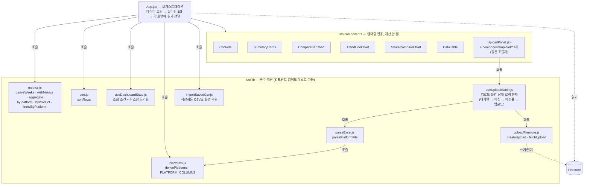
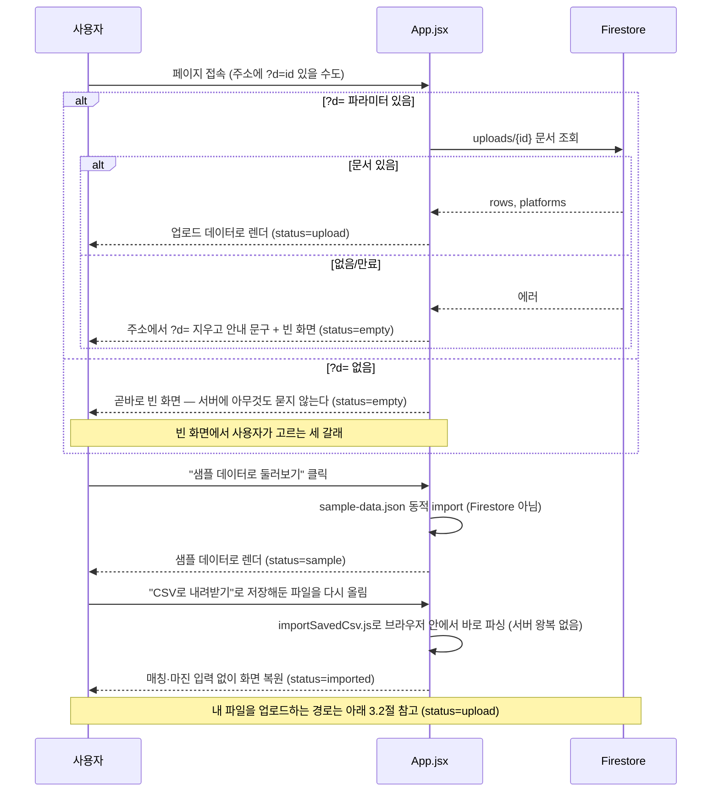
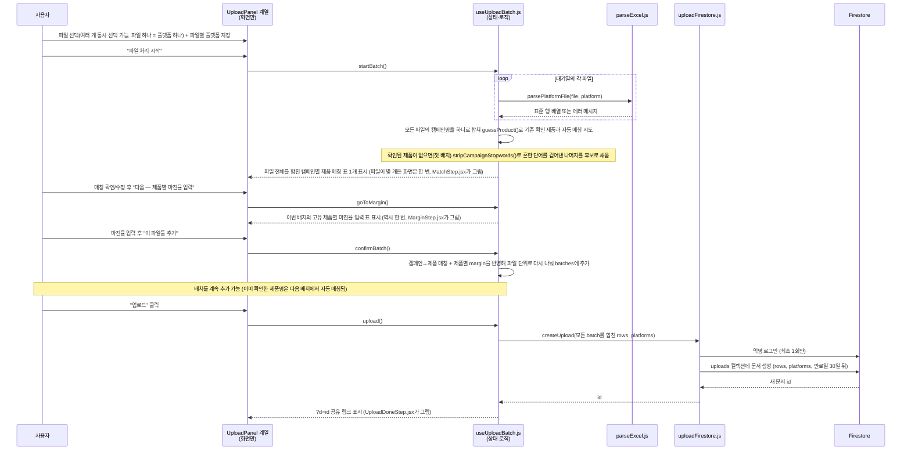
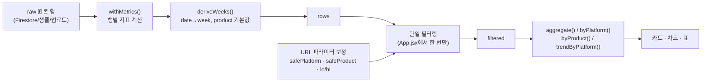

# Campaign Insight — 사양서

이 문서는 코드를 처음 보는 사람이 "데이터가 어떤 모양이고, 화면까지 어떻게 흘러가는가"를 빠르게 파악하도록 정리한 기술 사양서다. 실행 방법은 [README.md](README.md), 기획 배경은 [CLAUDE.md](CLAUDE.md)를 본다.

---

## 1. 데이터 스키마

### 1.1 원본 행 (Firestore·샘플·업로드 공통)

| 필드 | 타입 | 필수 | 설명 |
|---|---|---|---|
| `date` | string (`YYYY-MM-DD`) | 필수 | 광고가 집행된 날짜 |
| `platform` | string | 필수 | `naver` \| `meta` \| `google` \| `kakao` (업로드 시 다른 값도 가능) |
| `campaign` | string | 업로드만 | 원본 캠페인명. 저장은 하지만 지금은 필터·차트에 안 씀 |
| `adGroup` | string | 업로드만 | 원본 광고그룹명. 저장만 함 |
| `product` | string | 선택 | 없으면 모든 행이 `'전체'` 한 종류로 취급됨 |
| `adSpend` | number | 필수 | 광고비 (원) |
| `impressions` | number | 필수 | 노출수 |
| `clicks` | number | 필수 | 클릭수 |
| `conversions` | number | 필수 | 전환수(구매 완료 수) |
| `revenue` | number | 필수 | 이 전환들로 발생한 매출 (원) |
| `margin` | number \| null | 선택 | 마진율(원가율의 반대, 0~1). 없으면 이익·ROI 계산 자체가 불가능(`null`) |
| `week` | number | — | 저장돼 있어도 **항상 무시**된다. 실제 주차는 아래 1.2의 계산으로 매번 새로 만들어진다 |

CTR·ROAS처럼 플랫폼이 이미 계산해서 주는 비율 컬럼은 애초에 받지 않는다. 원본 카운트만 가져오고, 비율은 항상 이 앱이 다시 계산한다 — "합계를 먼저 내고 지표를 계산한다"는 원칙 때문이다(4장 참고).

### 1.2 `deriveWeeks()` — 날짜 → 주차 (`src/lib/metrics.js`)

실제 플랫폼 리포트는 일 단위인데 화면은 주 단위로 본다. 데이터셋 전체에서 가장 이른 `date`를 1주차 시작으로 놓고 7일 단위로 묶는다.

```
week = floor((이 행의 date - 데이터셋 전체 최소 date) / 7일) + 1
```

파일을 여러 개 합쳐 올려도 **합쳐진 전체 기준으로** 주차가 다시 매겨지므로, 파일마다 날짜 범위가 달라도 문제없다. `product`가 없는 행은 이 단계에서 `'전체'`로 채워진다.

### 1.3 `withMetrics()` — 한 행의 파생 지표 (`src/lib/metrics.js`)

| 필드 | 계산식 | 비고 |
|---|---|---|
| `ctr` | 클릭수 ÷ 노출수 | 노출수 0이면 0 |
| `cvr` | 전환수 ÷ 클릭수 | 클릭수 0이면 0 |
| `roas` | 매출 ÷ 광고비 | 광고비 0이면 0 |
| `cpc` | 광고비 ÷ 클릭수 | 클릭수 0이면 0 |
| `cac` | 광고비 ÷ 전환수 | 전환수 0이면 0 |
| `cogs` | 매출 × (1 − 마진율) | `margin`이 없으면 `null` |
| `profit` | 매출 − 원가 − 광고비 | `cogs`가 `null`이면 `null` |
| `roi` | 이익 ÷ 광고비 | `profit`이 `null`이거나 광고비 0이면 `null`/0 |

### 1.4 `aggregate()` — 여러 행을 합친 지표 (`src/lib/metrics.js`)

**절대 "행별 비율의 평균"을 내지 않는다.** 광고비·노출·클릭·전환·매출·원가를 먼저 전부 더한 뒤, 그 합계로 비율을 다시 계산한다. 주차별 ROAS 4개를 평균 내면 광고비가 적은 주가 과대 반영되기 때문이다.

한 행이라도 `margin`이 없으면 이 묶음 전체의 이익·ROI·손익분기는 계산을 포기하고 `null`, 손익분기는 예전 기준(ROAS 100%)으로 되돌아간다. 업로드 배치의 마진율은 전부 채우거나 전부 비워야 한다는 뜻이다.

| 필드 | 계산식 |
|---|---|
| `breakevenRoas` | `margin` 없으면 `1`(=100%), 있으면 `1 ÷ 혼합마진율` |

---

## 2. 아키텍처 개요



`lib/`는 React를 몰라도 되는 순수 함수만 모아둔다. `components/`는 계산된 값을 받아 그리기만 하고, 스스로 원본 배열을 다시 거르거나 지표를 다시 계산하지 않는다. `App.jsx`가 유일하게 둘을 잇는 자리다.

---

## 3. 시퀀스 다이어그램

### 3.1 데이터 로딩 (`App.jsx`의 `useEffect`)

**앱은 `campaigns` 컬렉션을 읽지 않는다.** 문서 1,800개를 페이지 열 때마다 통째로 읽으면 무료 읽기 한도(하루 5만 회)가 순식간에 끝나서(하루 27번이면 소진), 데모 데이터는 아예 서버에서 안 읽고 앱 안에 내장했다(`src/sample-data.json`). 그래서 첫 화면이 뜰 때 `App.jsx`가 서버에 묻는 건 **공유 링크(`?d=`) 하나뿐**이고, 그것도 없으면 아무것도 안 묻고 바로 빈 화면이다.



### 3.2 업로드 (`UploadPanel.jsx`)



---

## 4. 조회 조건 처리 흐름



주소로 들어온 `platform`·`product`·`from`·`to` 값은 실제 데이터가 가진 범위 안으로 보정된 뒤에야 필터링에 쓰인다 — `?from=99`처럼 범위 밖 값이 들어와도 깨지지 않는 이유다. 필터링은 이 그림에서 **딱 한 번**만 일어나고, 카드·차트·표는 그 결과(`filtered`)를 나눠 쓸 뿐 각자 다시 거르지 않는다.

---

## 5. 지표 계산식 요약

| 지표 | 계산식 | 이 지표로 알 수 있는 것 |
|---|---|---|
| CTR | 클릭수 ÷ 노출수 | 광고 소재가 매력적인가 |
| 전환율(CVR) | 전환수 ÷ 클릭수 | 들어온 사람이 실제로 사는가 |
| 클릭단가(CPC) | 광고비 ÷ 클릭수 | 클릭 1번의 비용 |
| ROAS | 매출 ÷ 광고비 | 이 채널에 돈을 더 써야 하는가 |
| 이익 | 매출 − 원가 − 광고비 | `margin` 있을 때만. 마이너스면 팔수록 손해 |
| ROI | 이익 ÷ 광고비 | 원가까지 뺀 진짜 수익성 |
| 손익분기 ROAS | 1 ÷ 혼합마진율 (없으면 100%) | 이 지점을 넘어야 실제로 남는다 |

화면에 상시 노출되는 지표는 CTR·전환율·ROAS 3개로 고정돼 있다. 클릭단가·이익·ROI는 표에만, 마진 데이터가 있을 때만 조건부로 나타난다 — [CLAUDE.md](CLAUDE.md)의 "지표는 3개로 고정한다" 참고.

---

## 6. 파일별 책임과 테스트 커버리지

`●`은 그 파일 이름의 전용 테스트 파일이 있다는 뜻이다. `src/lib/__tests__/`·`src/components/__tests__/`에 있다.

### src/lib/ — 계산과 데이터 처리

| 파일 | 책임 | 테스트 |
|---|---|---|
| `metrics.js` | 지표 계산 전부 — `deriveWeeks`·`withMetrics`·`aggregate`·`byPlatform`·`byProduct`·`trendByPlatform` | ● `metrics.test.js` (19) |
| `sort.js` | 표 정렬 (`sortRows`) | ● `sort.test.js` (4) |
| `useDashboardState.js` | 조회 조건(플랫폼·제품·기간·정렬) 단일 관리 + 주소창 동기화 | — |
| `platforms.js` | 플랫폼 표시 정보 자동 인식(`derivePlatforms`), 업로드 컬럼 매핑(`PLATFORM_COLUMNS`) | — |
| `parseExcel.js` | 플랫폼 리포트 파일(.xlsx/.csv) → 표준 행 배열 (`parsePlatformFile`) | ● `parseExcel.test.js` (6) |
| `uploadFirestore.js` | 업로드 데이터 Firestore 쓰기/읽기 (`createUpload`·`fetchUpload`) | — (다른 테스트에서 가짜로 대체됨) |
| `useUploadBatch.js` | 업로드 화면의 상태·로직 전체 — 대기열 → 캠페인-제품 매칭(`guessProduct`) → 마진율 입력 → 업로드 | ● `useUploadBatch.test.js` (17) |
| `importSavedCsv.js` | "CSV로 내려받기"가 만든 파일을 다시 읽어 매칭·마진 입력 없이 화면을 복원 (서버에 안 씀) | ● `exportCsv.test.js` 안에서 |
| `exportCsv.js` | 표준 행 → CSV 문자열/파일 | ● `exportCsv.test.js` (11) |

### src/components/ — 화면 부품

| 파일 | 책임 | 테스트 |
|---|---|---|
| `Masthead.jsx` | 맨 위 로고+제목 | — |
| `ErrorBoundary.jsx` | 화면 전체 오류를 붙잡는 안전망 (유일한 클래스 컴포넌트) | — |
| `Controls.jsx` | 채널·제품·기간·정렬 조작 영역 | — |
| `SummaryCards.jsx` | 요약 카드 3장 | ● `SummaryCards.test.jsx` (2) |
| `CompareBarChart.jsx` | 채널/제품 비교 막대 (범용) | — |
| `TrendLineChart.jsx` | 주차별 추이 선그래프 | — |
| `ShareCompareChart.jsx` | 광고비 vs 매출 비중 막대 | — |
| `DataTable.jsx` | 원본 데이터 표 + 정렬 + 페이지네이션 | ● `DataTable.test.jsx` (1) |
| `UploadPanel.jsx` | 업로드 화면 조율자 (로직은 `useUploadBatch.js`) | — |
| `upload/*.jsx` (4개) | 업로드 단계별 화면 — 파일 선택·매칭·마진율·완료 | — (로직은 `useUploadBatch.test.js`가 간접 검증) |

### 그 외

| 파일 | 책임 |
|---|---|
| `src/firebase.js` | Firebase 앱·Firestore 초기화(`app`·`db`·`isConfigured`)만 한다 — `campaigns` 컬렉션을 읽는 코드는 없다(비용 문제로 제거, 위 3.1절 참고) |
| `src/App.jsx` | 데이터 로딩, 조건 적용, 화면 조립 — 유일한 오케스트레이션 지점 |

**계산 로직 쪽에 테스트가 뚜렷하게 쏠려 있다** — `lib` 9개 중 6개, `components` 10개 중 2개가 전용 테스트로 지켜진다. 여러 단계를 오가는 화면 컴포넌트(업로드 4단계, 차트류)는 상대적으로 얕다. 의도한 설계가 아니라 남은 과제다.

---

## 7. 반드시 지킬 제약 (요약)

- 지표 계산은 `metrics.js` 안에서만. 컴포넌트가 직접 계산하지 않는다
- 합계를 먼저 내고 나눈다 — 비율의 평균을 내지 않는다 (`aggregate()`)
- 조회 조건은 `useDashboardState` 한 곳에서만 바뀐다
- 필터링은 `App.jsx`에서 한 번만 한다
- 주소로 들어온 값은 항상 데이터 범위 안으로 보정한다
- `campaigns` 컬렉션은 읽기 전용. 업로드는 별도 `uploads` 컬렉션에 생성(create)만 허용

자세한 배경과 이유는 [CLAUDE.md](CLAUDE.md)에 있다.
