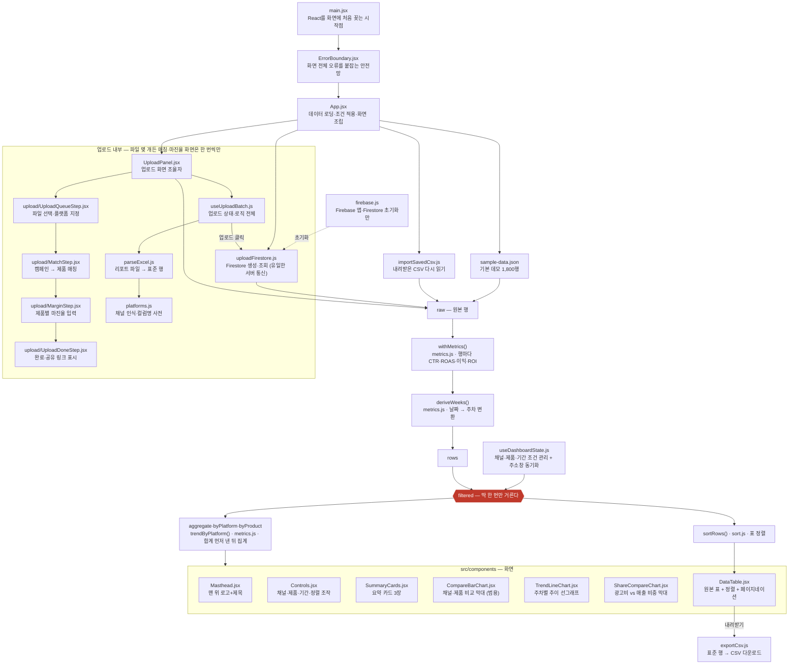

# Campaign Insight

**여러 광고 채널의 성과를 한 화면에서 비교해 예산 배분을 판단하는 대시보드**

배포 주소: https://hhgkosmo0607-lgtm.github.io/lumiere_campaign/
소스 코드: https://github.com/hhgkosmo0607-lgtm/lumiere_campaign

---

## 문제

네이버·메타·구글·카카오는 각자 자기 채널 성과만 보여준다. "이번 분기 예산을 어디로 옮길까"에는 어느 플랫폼도 답을 안 준다 — 경쟁 채널로 예산을 옮기라고 알려줄 이유가 그 플랫폼 입장에는 없기 때문이다.

그래서 실무에서는 채널별 성과를 엑셀로 옮겨 취합한다. "이번 주 메타만 보고 싶다" 같은 질문이 생길 때마다 필터·피벗·차트를 다시 만들어야 한다.

또 하나 — 광고 플랫폼은 제품 원가를 모른다. 그래서 ROAS(매출 기준)까지만 보여줄 수 있고, 실제로 남는 돈(ROI)은 계산해주지 않는다.

**이 대시보드가 메우는 두 가지: 플랫폼 통합 비교, 원가를 반영한 진짜 이익.**

---

## 가정한 상황

가상 스킨케어 브랜드 **루미에르**가 제품 5종(비타민C 세럼·수분크림·립밤 기프트세트·클렌징폼·아이크림)을 네이버·메타·구글·카카오 4개 채널에 90일간 광고한 상황이다.

- 총 광고비 1억 3,575만원, 총 매출 2억 7,308만원
- 다음 분기 예산을 어디에 더 쓸지 정해야 하는 시점

> 실제 광고 계정 데이터에 접근할 수 없어 직접 설계한 가상 데이터다. 검색은 클릭률이 낮고 전환율이 높고, 소셜은 반대, 리타겟팅은 후반에 개선된다는 실제 채널 특성을 반영했다. 제품마다 잘 맞는 채널도 다르게 심었다 — 세럼은 네이버, 수분크림은 메타, 립밤세트는 카카오, 클렌징폼은 구글.

---

## 지표는 3개만 씁니다

지표가 많을수록 판단이 흐려진다. 예산을 어디에 쓸지 정하는 데 필요한 것만 남겼다.

| 지표 | 계산 | 무엇을 보여주나 |
|---|---|---|
| **CTR** | 클릭수 ÷ 노출수 | 광고가 눈길을 끄는가 |
| **전환율** | 전환수 ÷ 클릭수 | 들어온 사람이 실제로 사는가 |
| **ROAS** | 매출 ÷ 광고비 | 이 채널에 돈을 더 써야 하는가 |

CTR과 전환율을 같이 보는 이유: 둘이 갈리는 지점에서 원인이 드러난다. CTR은 높은데 전환율이 낮으면 소재가 아니라 랜딩페이지·타겟팅 문제다.

원가율(마진)을 넣으면 이익·ROI도 볼 수 있다 — 지표를 늘리는 게 아니라, 같은 화면에서 "매출 기준(ROAS)"과 "진짜 남는 돈 기준(ROI)" 중 뭘 볼지 전환하는 방식이다.

---

## 데이터에서 찾은 것

**ROAS 201%, ROI −1.6%.** 매출만 보면 광고비의 2배가 넘지만, 원가를 빼면 남는 게 거의 없다. 원가를 모르는 광고 플랫폼은 ROAS까지만 보여주고 "벌고 있다"는 착시를 만든다.

**채널별로는 카카오 296%가 가장 높고 메타 141%가 가장 낮다.** 메타는 CTR 2.58%로 제일 높지만 전환율은 1.56%로 제일 낮다. 광고비의 39%를 쓰고 매출은 28%만 낸다. 최근 4주는 141% → 123%로 더 떨어졌다 — 소재 피로도가 쌓이는 채널이다.

**구글은 늦게 오르는 채널이다.** 초반 135% → 최근 4주 264%. 리타겟팅 대상이 쌓이면서 좋아지는 구조라, 초반 숫자만 보고 껐으면 손해였을 구간이다.

**제품별로 보면 이야기가 완전히 달라진다.** 채널 1위 카카오는 사실 립밤 기프트세트 하나가 끌고 간 결과다. 세럼은 네이버, 수분크림은 메타, 립밤세트는 카카오, 클렌징폼은 구글에서 각각 제일 잘 팔린다 — 채널 하나에 몰아주는 게 아니라 제품마다 다른 채널에 배분해야 한다. 아이크림은 전 채널 ROI가 마이너스(−58%)라 광고를 줄이는 게 맞다.

**제안** — 메타 예산 일부를 카카오로, 메타는 예산을 줄이고 소재를 바꿔 이탈부터 잡는다. 구글은 상승 추세라 유지한다. 아이크림 예산은 줄이고 나머지 네 제품은 각자 강세 채널로 재배치한다.

**이 네 줄은 사람이 미리 써둔 문장이 아니라, 화면이 그때그때 계산해서 만든 것이다.** "카카오가 1등이다", "메타가 39%를 쓰고 28%밖에 못 번다" 같은 채널 이름과 숫자는 지금 화면에 떠 있는 데이터에서 매번 새로 뽑는다 — 1등·꼴찌를 정하고, 광고비·매출 비중을 나누고, 최근 몇 주간 오르는지 내리는지를 계산해서 그 결과를 문장 틀에 끼워 넣는 방식이다. 그래서 내 리포트를 올려서 1등이 카카오가 아니라 다른 채널로 바뀌어도, 사람이 문장을 다시 쓸 필요 없이 이 문단이 알아서 새 채널 이름과 새 숫자로 바뀐다.

만드는 과정은 파일 두 개, 5단계다.

**1. 걸러진 데이터를 채널별로 먼저 합산한다.** 실제 계산(더하고 나누는 것)은 전부 `metrics.js`가 하고, `App.jsx`는 그 결과를 받아두기만 한다.

`src/App.jsx`
```js
const totals = useMemo(() => aggregate(filtered), [filtered]);           // 전체 합계
const platforms = useMemo(() => byPlatform(filtered, activePlatforms), [filtered, activePlatforms]); // 채널별 합계
const trend = useMemo(() => trendByPlatform(filtered, activePlatforms), [filtered, activePlatforms]); // 채널별 주차 흐름
```

**2. 채널별 합계에서 1등·꼴찌·추세를 정한다.**

`src/App.jsx`
```js
const sorted = [...platforms].sort((a, b) => b.roas - a.roas);
const best = sorted[0];             // ROAS 1등 채널
const worst = sorted[sorted.length - 1]; // ROAS 꼴찌 채널

// 채널별 추세 중 변화율이 가장 큰 채널 하나. 전부 보합이면 null.
const trendPick = trend.series
  .map((s) => ({ ...s, ...trendDirection(s.points, metric) }))
  .filter((s) => s.dir !== 'flat')
  .reduce((a, b) => (!a || Math.abs(b.change) > Math.abs(a.change) ? b : a), null);
```

**3. 1등·꼴찌 채널의 클릭률·전환율을 전체 평균과 비교해 넷 중 하나로 분류한다.**

`src/lib/metrics.js` — `funnelDiagnosis()`
```js
export function funnelDiagnosis(ctr, cvr, avgCtr, avgCvr, margin = 0.15) {
  const ctrHigh = avgCtr > 0 && ctr > avgCtr * (1 + margin);
  const ctrLow = avgCtr > 0 && ctr < avgCtr * (1 - margin);
  const cvrHigh = avgCvr > 0 && cvr > avgCvr * (1 + margin);
  const cvrLow = avgCvr > 0 && cvr < avgCvr * (1 - margin);
  if (ctrHigh && cvrHigh) return 'both-high';
  if (ctrHigh && cvrLow) return 'ctr-high-cvr-low';
  if (ctrLow && cvrHigh) return 'ctr-low-cvr-high';
  if (ctrLow && cvrLow) return 'both-low';
  return 'mixed';
}
```

**4. 분류 결과를 실제 읽을 수 있는 문장으로 바꾸는 표.**

`src/App.jsx` — `FUNNEL_TEXT`
```js
const FUNNEL_TEXT = {
  'both-high': '노출부터 구매까지 전 구간이 평균보다 강하다.',
  'ctr-high-cvr-low': '클릭은 평균보다 잘 나오지만, 클릭 이후 전환은 평균보다 약하다 — 랜딩페이지나 타겟팅을 점검할 지점이다.',
  'ctr-low-cvr-high': '클릭은 평균보다 적지만, 일단 들어온 사람은 확실히 산다 — 이미 살 마음이 있는 트래픽일 가능성이 높다.',
  'both-low': '클릭도 전환도 평균을 밑돈다.',
  mixed: '',
};
```

**5. 계산된 값과 문장을 화면 문단에 그대로 끼워 넣는다.**

`src/App.jsx`
```jsx
<b>{best.name}</b>의 ROAS가 {Math.round(best.roas * 100)}%로 가장 높다.{' '}
{FUNNEL_TEXT[funnelDiagnosis(best.ctr, best.cvr, totals.ctr, totals.cvr)]}
```

### 기간을 좁혀 다시 보면

최근 4주만 보면 메타(141%→123%)는 계속 나빠지고 구글(전체 평균 188%→최근 4주 264%)은 계속 좋아진다. 90일 전체 평균만 봤으면 안 보였을 차이다.

채널과 제품을 같이 좁혀도 다르게 보인다. "수분크림 + 메타"만 보면 ROAS 264%로, 수분크림 전체 평균(210%)보다 훨씬 높다.

---

## 내 데이터로도 됩니다

루미에르는 미리 채워둔 예시일 뿐이다. 네이버·구글·메타·카카오 광고관리자에서 내보낸 리포트 파일을 **컬럼명 그대로** 올리면 같은 화면이 만들어진다. 플랫폼마다 다른 컬럼명(노출수/Impr./Impressions)을 자동으로 맞춰 읽는다.

| 캐노니컬 | 네이버 | 구글 | 메타 | 카카오 |
|---|---|---|---|---|
| 날짜 | 날짜 | Date | Day | 날짜 |
| 노출수 | 노출수 | Impr. | Impressions | 노출수 |
| 클릭수 | 클릭수 | Clicks | Link clicks | 클릭수 |
| 광고비 | 광고비 | Cost | Amount spent | 비용 |
| 전환수 | 구매완료 전환수 | Conversions | Purchases | 구매 |
| 매출 | 구매완료 전환매출액 | Conversion value | Purchase conversion value | 구매금액 |

리포트 하나엔 보통 여러 제품의 캠페인이 섞여 있다. 파일을 올리면 캠페인마다 어느 제품인지 확인받고(이미 아는 제품명이면 자동으로 채워줌), 원가율(마진)을 넣으면 ROAS 대신 실제 이익(ROI)으로도 볼 수 있다. 마진율은 캠페인이 아니라 제품 단위로 한 번만 받는다 — 캠페인마다 따로 받으면 같은 제품인데 값이 어긋나는 실수가 생기기 때문이다.

---

## 어떻게 만들었나

- **Firebase Firestore** — 사용자가 올린 데이터 저장·공유(생성만 허용, 링크로 조회). 기본 데모 데이터도 처음엔 여기서 읽었는데, 문서 1,800개라 페이지 한 번 여는 데 읽기 1,800회가 나갔다(무료 한도로 하루 27번이면 끝). 그래서 데모 데이터는 앱 안에 내장하고, 서버는 실제 업로드 데이터만 다루게 바꿨다.
- **React** — 화면에 있는 데이터로 지표를 계산하고 그린다. 채널을 바꾸면 카드·차트·표가 같이 갱신된다. 서버에 다시 안 묻고 이미 받은 데이터를 걸러내는 방식이라 즉시 반응한다.
- **그래프** — 라이브러리 없이 SVG로 직접 그렸다. 손익분기선(이 선을 넘겼는가)이 핵심 장치다. 원가율이 있으면 실제로 남는 지점(1÷마진율)으로 움직인다 — 지금 데모는 205% 근처.

### 데이터가 화면까지 가는 길

들어오는 경로는 네 갈래(공유 링크·샘플·CSV 복원·업로드)지만, 조건을 거는 지점은 **딱 한 곳**이다. 카드·차트·표가 각자 다시 거르지 않고 이 한 지점(`filtered`)만 나눠 쓰기 때문에 화면끼리 숫자가 어긋나지 않는다.

`src/` 코드 파일(테스트 제외) 27개 전부가 이 그림 하나 안에 있다 — 업로드도 안 쪼개고 그대로 넣었다. `index.css`만 예외다(특정 흐름이 아니라 모든 화면이 공통으로 쓰는 색·서체 변수라 화살표로 그릴 게 없다).

🔍 [확대해서 보기 (+/− 버튼, 같은 그림)](https://claude.ai/code/artifact/f620c896-e842-46c9-831d-d979594e938e)



*Masthead.jsx·Controls.jsx는 계산 결과가 아니라 App.jsx가 직접 내려주는 고정 값·목록만 받는다. 서버에는 배치를 다 쌓은 뒤 마지막에 한 번만 올라간다.*

### 같은 흐름을 말로 따라가면

1. **`main.jsx`**가 `ErrorBoundary.jsx`로 감싼 `App.jsx`를 화면에 꽂는다. `firebase.js`는 이때 `uploadFirestore.js`가 쓸 수 있게 Firebase 연결만 준비해둔다.
2. `App.jsx`는 넷 중 하나로 데이터를 얻는다 — 주소에 공유 링크(`?d=`)가 있으면 `uploadFirestore.js`로 서버에서 받아오고, 없으면 **아무것도 안 받고 빈 화면**에서 시작한다. "샘플 데이터로 둘러보기"를 누르면 그때 `sample-data.json`을, "CSV 다시 불러오기"를 누르면 `importSavedCsv.js`가 파일을 읽는다.
3. **내 리포트를 업로드**하는 경우만 따로 본다 — `UploadPanel.jsx`가 화면 4단계(`UploadQueueStep.jsx` → `MatchStep.jsx` → `MarginStep.jsx` → `UploadDoneStep.jsx`)와 로직(`useUploadBatch.js`)을 조립한다. 로직 쪽은 `parseExcel.js`(+`platforms.js`)로 파일을 표준 행으로 바꾸고, 배치를 다 쌓은 뒤 마지막에 `uploadFirestore.js`로 한 번만 올린다.
4. 어느 경로든 원본 행(`raw`)이 모이면 `metrics.js`의 `withMetrics()`가 한 줄씩 CTR·ROAS·이익·ROI를 계산해 붙이고, `deriveWeeks()`가 날짜를 주차로 바꾼다. 여기까지 끝난 게 `rows`다.
5. `useDashboardState.js`가 들고 있는 채널·제품·기간 조건이 `rows`와 합쳐지는 지점이 **`filtered`**다 — 이 프로젝트에서 조건을 적용하는 건 여기 딱 한 번뿐이다.
6. `filtered` 하나를 `metrics.js`의 `aggregate()`·`byPlatform()`·`byProduct()`·`trendByPlatform()`과 `sort.js`의 `sortRows()`가 각자 다른 방식으로 집계한다. 전부 같은 원본을 나눠 쓰기 때문에 결과끼리 어긋날 수가 없다.
7. 계산된 값은 `components/`의 화면 7개(`Masthead`·`Controls`·`SummaryCards`·`CompareBarChart`·`TrendLineChart`·`ShareCompareChart`·`DataTable`)로 나뉘어 그려진다. `DataTable.jsx`에서 "CSV로 내려받기"를 누르면 `exportCsv.js`가 지금 걸러진 결과 그대로 파일을 만든다.

### 판단이 들어간 두 줄

위 7단계 중 실제로 고민이 필요했던 지점은 두 곳이다. 나머지는 "데이터를 어디서 어디로 옮기나"였고, 이 둘만 "어떻게 짜야 맞나"였다.

**5번, `filtered` — 조건을 적용하는 곳을 하나로 강제한다.** 카드·그래프·표가 각자 `rows`를 다시 걸러내게 두면 필터 로직이 여러 곳에 복사되고, 그중 하나만 실수로 다르게 짜여도 화면끼리 숫자가 어긋난다. 그래서 `App.jsx` 안에 조건을 적용하는 곳을 이 한 줄로 못박았다.

`src/App.jsx` — filtered
```js
// ★ 이 프로젝트에서 가장 중요한 한 줄. 조건(채널·제품·기간)을 여기서 딱 한 번만
// 적용하고, 아래의 카드·그래프·표는 전부 이 filtered 하나만 받아서 쓴다. 컴포넌트마다
// 각자 원본 rows를 다시 걸러내게 두면, 필터 로직이 여러 곳에 복사되고 하나만 실수로
// 다르게 짜여도 화면끼리 숫자가 어긋난다 — 그걸 막으려고 한 곳으로 강제한 것이다.
const filtered = useMemo(
  () =>
    rows.filter(
      (r) =>
        (safePlatform === 'all' || r.platform === safePlatform) &&
        (safeProduct === 'all' || r.product === safeProduct) &&
        r.week >= lo &&
        r.week <= hi
    ),
  [rows, safePlatform, safeProduct, lo, hi]
);
```

**6번, `aggregate()` — 평균의 평균을 쓰지 않는다.** 채널별 ROAS는 주차별 ROAS를 평균 내면 안 된다. 광고비가 적었던 주와 많았던 주가 똑같은 비중으로 섞여서, 실제로 돈을 많이 쓴 주의 성과가 축소된다. 그래서 행을 먼저 다 더한 뒤 마지막에 한 번만 나눈다. margin이 하나라도 빠진 행이 섞이면 이익·ROI 계산 자체를 포기하고 손익분기를 ROAS 100%로 되돌리는 것도 이 함수가 정한다.

`src/lib/metrics.js` — aggregate()
```js
export function aggregate(rows) {
  const hasMargin = rows.length > 0 && rows.every((r) => r.margin != null);

  const sum = rows.reduce(
    (a, r) => ({
      adSpend: a.adSpend + r.adSpend,
      impressions: a.impressions + r.impressions,
      clicks: a.clicks + r.clicks,
      conversions: a.conversions + r.conversions,
      revenue: a.revenue + r.revenue,
      cogs: a.cogs + (hasMargin ? r.revenue * (1 - r.margin) : 0),
    }),
    { adSpend: 0, impressions: 0, clicks: 0, conversions: 0, revenue: 0, cogs: 0 }
  );

  const base = withMetrics(sum);
  if (!hasMargin) return { ...base, cogs: null, profit: null, roi: null, breakevenRoas: 1 };

  const profit = sum.revenue - sum.cogs - sum.adSpend;
  const blendedMargin = sum.revenue ? 1 - sum.cogs / sum.revenue : 1;
  return {
    ...base,
    cogs: sum.cogs,
    profit,
    roi: sum.adSpend ? profit / sum.adSpend : 0,
    breakevenRoas: blendedMargin > 0 ? 1 / blendedMargin : 1,
  };
}
```

### 파일 하나, 기능 하나

"파일 하나 = 함수 하나"는 아니다 — 함수가 몇 개든 하는 일(기능)이 하나면 같은 파일에 둔다. 계산이 한 곳에 있어야 하는 것끼리는 한 파일에 다 모아두고, 관련 없는 건 파일을 나눈다. `metrics.js`가 계산 함수 12개를 갖고 있는 것도, 업로드 화면 4개가 각자 파일로 쪼개진 것도 같은 원칙(관련된 건 묶고, 아니면 나눈다)의 결과다.

**`src/lib/` — 계산과 데이터 처리 (화면을 안 그림)**

| 파일 | 기능 |
|---|---|
| `useUploadBatch.js` | 업로드 화면의 상태·로직 전체 — 대기열 → 매칭 → 마진율 → 업로드 |
| `metrics.js` | 지표 계산 엔진 전체 — CTR·ROAS·ROI·손익분기·추세 진단까지 12개 함수 |
| `parseExcel.js` | 플랫폼 리포트 파일(.xlsx/.csv) → 표준 행 |
| `useDashboardState.js` | 조회 조건 관리 + 주소창 동기화 |
| `importSavedCsv.js` | 내려받은 CSV → 표준 행 (형식이 달라 파서가 따로 있음) |
| `platforms.js` | 채널 자동 인식 + 업로드 컬럼 매핑 |
| `exportCsv.js` | 표준 행 → CSV 다운로드 |
| `uploadFirestore.js` | 서버와 통신하는 유일한 파일 |
| `sort.js` | 표 정렬 |

**`src/components/` — 화면 부품 (받은 값을 그리기만 함)**

| 파일 | 기능 |
|---|---|
| `TrendLineChart.jsx` | 주차별 추이 선그래프 |
| `DataTable.jsx` | 원본 데이터 표 + 정렬 + 페이지네이션 |
| `Controls.jsx` | 채널·제품·기간·정렬 조작 영역 |
| `upload/UploadQueueStep.jsx` | 업로드 1단계 — 파일 선택 |
| `CompareBarChart.jsx` | 채널/제품 비교 막대 (범용, 두 곳에서 재사용) |
| `UploadPanel.jsx` | 업로드 화면 조율자 (로직은 `useUploadBatch.js`) |
| `ShareCompareChart.jsx` | 광고비 vs 매출 비중 막대 |
| `upload/MatchStep.jsx` | 업로드 2단계 — 캠페인→제품 매칭 |
| `SummaryCards.jsx` | 요약 카드 3장 |
| `upload/MarginStep.jsx` | 업로드 3단계 — 제품별 마진율 입력 |
| `ErrorBoundary.jsx` | 화면 전체 오류를 붙잡는 안전망 (유일한 클래스 컴포넌트) |
| `upload/UploadDoneStep.jsx` | 업로드 4단계 — 공유 링크 표시 |
| `Masthead.jsx` | 맨 위 로고+제목 |

---

## 자동 테스트로 지킨 것 — 60개

계산이 한 곳(`metrics.js`)에만 있어도 그 계산식이 맞다는 보장은 아니다. 그래서 "실제로 있었던 버그가 다시 생기면 실패하는" 테스트를 넣었다.

| 테스트 파일 | 무엇을 검사하나 | 개수 |
|---|---|---|
| <mark>`metrics.test.js`</mark> | 계산 엔진 전부 — <mark>주차별로 합계를 먼저 내는지</mark>, 마진 없으면 ROI를 비워두는지, 손익분기가 맞는지 | 19 |
| `useUploadBatch.test.js` | 업로드 흐름 — 제품 자동 추측, 마진율 검증, 3,000행 초과 거부 | 17 |
| `exportCsv.test.js` | CSV 내보내기 + 왕복 검증(다시 읽으면 원본과 같은지) | 11 |
| <mark>`parseExcel.test.js`</mark> | <mark>날짜·숫자 읽기 — 실제 리포트의 날짜가 하루 밀리던 버그 재발 방지</mark> | 6 |
| `sort.test.js` | 표 정렬 — 값이 같을 때 순서가 항상 같은지 | 4 |
| `SummaryCards.test.jsx` | 카드가 계산 안 하고 받은 값만 찍는지 | 2 |
| `DataTable.test.jsx` | 조건이 바뀌면 1페이지로 돌아가는지 | 1 |
| **합계** | | **60** |

**1. 주차별 그래프가 그 주의 첫 행 하나만 보고 있었다.** 한 주에는 7일×제품 수만큼 행이 여러 개 있는데, `find()`(조건에 맞는 걸 하나만 찾고 멈춤)로 짜여 있어서 그중 우연히 첫 번째로 걸린 하루치가 그 주 전체 값으로 찍혔다. 그 첫날이 하필 전환 0(광고 시작 직후 흔한 일)이면 ROAS가 0%로 나온다 — 나머지 6일에 전환이 잘 나와서 주 전체로 합치면 실제로는 200%인데도. `find()`를 `filter()`(조건에 맞는 걸 전부 모음)로 바꾸고, 이 상황 그대로를 테스트로 박아뒀다.

`src/lib/metrics.js` — 변경 전
```js
// trendByPlatform() 안, 주차별 값을 뽑던 부분
const hit = p.rows.find((r) => r.week === w);   // 그 주차의 "첫 번째 행 하나"만 찾음
return { week: w, roas: hit ? hit.roas : 0 };   // 그 하루치 ROAS를 주차 전체 값으로 씀
```

`src/lib/metrics.js` — 변경 후
```js
// 한 주차엔 여러 날 × 여러 제품의 행이 들어 있다. 그중 한 행을 집어 쓰면 안 되고,
// 그 주차 전체의 광고비·매출을 먼저 합산한 뒤 비율을 낸다 (합계를 먼저 내는 원칙).
const weekRows = p.rows.filter((r) => r.week === w);
if (weekRows.length === 0) return { week: w, roas: null, roi: null };
const a = aggregate(weekRows);
return { week: w, roas: a.roas, roi: a.roi ?? 0 };
```

**2. 실제 플랫폼 파일을 올리면 날짜가 하루 밀렸다.** 엑셀의 날짜 셀을 한국 시간대에서 읽으면 `2026-05-01`이 `2026-04-30`으로 밀리는 버그였다. 우리가 만든 테스트용 샘플 파일은 날짜를 문자열로 저장해서 이 문제를 안 겪었고, 계산 검증 스크립트(`npm run verify`)도 날짜가 통째로 하루씩 밀리면 주차 계산 자체는 맞아떨어져서 못 잡았다 — **실제 플랫폼이 내보내는 진짜 엑셀 파일을 올려야만** 재현되는 종류였다. 실제로 그런 파일을 하나 만들어서 재현한 뒤에야 찾았다.

`src/lib/parseExcel.js` — 변경 전
```js
export function toIsoDate(raw) {
  const d = raw instanceof Date ? raw : new Date(String(raw).trim());
  if (Number.isNaN(d.getTime())) return null;
  return d.toISOString().slice(0, 10);   // UTC로 환산되면서 한국에서는 하루 밀림
}
```

`src/lib/parseExcel.js` — 변경 후
```js
const pad2 = (n) => String(n).padStart(2, '0');

// xlsx는 엑셀의 날짜 셀을 '로컬 자정' Date로 돌려준다. toISOString()은 이걸 UTC로
// 바꾸는데, 한국(UTC+9)에서는 자정이 전날 15시가 돼서 날짜가 하루씩 밀린다.
const localIso = (d) => `${d.getFullYear()}-${pad2(d.getMonth() + 1)}-${pad2(d.getDate())}`;

export function toIsoDate(raw) {
  if (raw instanceof Date) {
    return Number.isNaN(raw.getTime()) ? null : localIso(raw);
  }
  const s = String(raw ?? '').trim();

  // "YYYY-MM-DD" 문자열은 Date를 거치지 않고 그대로 쓴다 — new Date()로 파싱하면
  // 이것도 UTC 자정으로 해석돼서 같은 문제가 생긴다.
  const m = s.match(/^(\d{4})-(\d{2})-(\d{2})/);
  if (m) {
    const [, y, mo, d] = m;
    // 2026-13-45처럼 형태만 맞고 실제로는 없는 날짜를 걸러낸다.
    const probe = new Date(Date.UTC(Number(y), Number(mo) - 1, Number(d)));
    if (probe.getUTCFullYear() !== Number(y)
      || probe.getUTCMonth() !== Number(mo) - 1
      || probe.getUTCDate() !== Number(d)) return null;
    return `${y}-${mo}-${d}`;
  }

  // 그 밖의 형식("2026/05/01" 등)은 브라우저 파서에 맡기되, 로컬 기준으로 읽는다.
  const parsed = new Date(s);
  return Number.isNaN(parsed.getTime()) ? null : localIso(parsed);
}
```

---

## 다음에 붙일 것

- 목표 ROAS 입력 후 미달 채널 자동 표시
- Google Analytics 4 연동으로 실제 데이터 적용
- 캠페인별·소재별 비교 화면 (지금은 데이터에 저장만 하고 화면엔 안 씀)
- SKU 기반 제품 식별 (지금은 제품이 몇 개뿐이라 이름으로 충분하지만, 늘어나면 필요)
- 채널별 마진율 (지금은 제품 단위 값 하나만 받음)
- **B2B 시나리오의 실사용자 검증** — B2B 샘플 데이터로 계산이 맞는 건 `npm run verify`가 매번 확인하지만, 실제 B2B 마케터가 이 흐름을 자연스럽게 느낄지는 다음 단계다

제품×플랫폼 비교는 위 필터 조합으로 지금도 볼 수 있어 뺐다. 나머지는 일부러 지금 안 만들었다 — 다 붙이면 "채널 통합 비교 + 원가 기반 ROI"라는 지금의 또렷한 이야기가 흐려진다.

---
